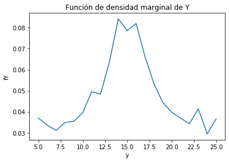

# Tarea3  - Mariela Castillo Cabezas B61610
## 1. A partir de los datos, encontrar la mejor curva de ajuste (modelo probabilístico) para las funciones de densidad marginales de X y Y.

Se realiza la lectura de los archivos proporcionados y se obtienen los datos para las funciones de densidad marginal, estas se grafican para observar el tipo de distribución que se planteará en el modelo:

    

Observando las gráficas obtenidas se eligió la distribución normal o gaussiana para el modelo ya que es la que más se asemeja a la distribución obtenida. Se definió esta como: 

    

Y se obtuvieron los parámetros mu y sigma que se ajustan mejor a los datos, utilizando el comando curve_fit de la librería scipy. Para la función de densidad marginal de X se tiene que mu = 9.90484381 y sigma = 3.29944286, para la función de densidad marginal de Y mu corresponde a 15.0794609 y sigma es 6.02693776. Estos valores se sustituyen en la ecuación presentada anteriormente para obtener la ecuación específica de cada función. 

## 2. Asumir independencia de X y Y, ¿cuál es entonces la función de densidad conjunta que modela los datos? 
Asumiento que existente independencia de X y Y, la función de densidad conjunta que modela los datos proporcionados viene dada por la multiplicación de las funciones de densidad marginales obtenidas en el inciso 1: 

    

Es decir:

    

## Hallar los valores de correlación, covarianza y coeficiente de correlación (Pearson) para los datos y explicar su significado

* Correlación:
La correlación hace referencia al grado en el cual dos o más cantidades están linealmente asociadas. Para los datos proporcionados se obtuvo un valor de 149.542810 el cual debe ser igual a la multiplicación de la media de las variables aleatorias ya que al asumirse independencia estadística se sabe que no hay correlación entre las variables. 
Se tiene que : 

    

    

El porcentaje de error entre este valor y la correlación hallada es de apenas 0.12% por lo que se comprueba que no existe correlación entre las variables.

* Covarianza: 
Según la teoría, si dos variables son estadísticamente independientes o no están relacionadas el valor de su covarianza es igual a 0. El valor obtenido fue de de 0.18310, bastante cercano al esperado por lo cual se confirma que no hay correlación entre las variables y son independientes. 

* Coeficiente de correlación: 
El coeficiente de correlación funciona como un indicador de la relación de linealidad o proporcionalidad entre dos variables. Se encuentra entre -1 y 1, si su valor es positivo las variables aumentan o disminuyen a la vez, si es negativo cuando una variable aumenta la otra disminuye y viceversa. Si el valor es igual a 0 signfica que no existe dependencia lineal entre las variables. El resultado hallado fue de 0.002301 por lo que se concluye que las variables no presentan dependencia lineal. 

## 4. Graficar las funciones de densidad marginales (2D), la función de densidad conjunta (3D).

