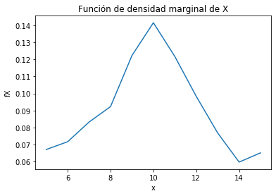

# Tarea3  - Mariela Castillo Cabezas B61610
## 1. A partir de los datos, encontrar la mejor curva de ajuste (modelo probabilístico) para las funciones de densidad marginales de X y Y.

Se realiza la lectura de los archivos proporcionados y se obtienen los datos para las funciones de densidad marginal, estas se grafican para observar el tipo de distribución que se planteará en el modelo:

    

Observando las gráficas obtenidas se eligió la distribución normal o gaussiana para el modelo ya que es la que más se asemeja a la distribución obtenida. Se definió esta como: 
fx(x)\quad =\quad \frac { 1 }{ \sqrt { 2\pi { \sigma  }^{ 2 } }  } exp\left[ \frac { { -(x-\mu ) }^{ 2 } }{ 2\sigma \frac { 2 }{ x }  }  \right] 
